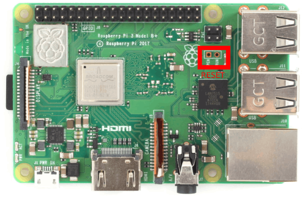

# Raspberry Pi Flashing Server

This README file contains instruction for building a Raspberry Pi Flashing server.  
The server contains TFTP file server which serves the flashed Raspberry Pi during the flashing process.  
It also used to hard-reset the flashed Raspberry Pi (the server is connected by the GPIO pins to the RESET lines of the Pi).

## Table of Contents

* [Raspberry Pi Flashing Server](#raspberry-pi-flashing-server)
  * [Table of Contents](#table-of-contents)
  * [I. Prerequisites](#i-prerequisites)
  * [II. Setting Up the Server](#ii-setting-up-the-server)
  * [III. Connecting Targets](#iii-connecting-targets)

## I. Prerequisites

* Raspberry Pi 3 (model B / B+) / Raspberry Pi 4B  
* At least 32GB Micro-SD Card(rated as Class 10 or above)  
* [Raspberry Pi OS Lite Image](https://downloads.raspberrypi.org/raspios_lite_armhf_latest)
* [Female to Female Jumper Wires](https://www.amazon.com/GenBasic-Piece-Female-Jumper-Wires/dp/B077NH83CJ/), [2.54 Headers](https://www.amazon.com/SUNKEE-Single-11MM-Header-Strip/dp/B008G8YTUA), Soldering Iron  

## II. Setting Up the Server

* Flash the Raspbian Image on an SD Card. [Linux](https://www.raspberrypi.org/documentation/installation/installing-images/linux.md) | 
 [Windows](https://www.raspberrypi.org/documentation/installation/installing-images/windows.md)  
* Default Username: *pi* | Password: *raspberry*  
* Enable SSH by creating a file named **ssh** on the Boot partition  
or by using *raspi-config*. You can read more about it [here](https://www.raspberrypi.org/documentation/remote-access/ssh/)  
* Set hostname by editing ``/etc/hostname`` (the hostname should be the same as the server db name [../scripts/db/<HOSTNAME.csv>](../scripts/db/) )
* Install TFTP Server  

```bash
sudo apt-get update  
sudo apt-get install tftpd-hpa
```  

* Edit the TFTP server configuration file `sudo nano /etc/default/tftpd-hpa`  
The content should look like this:

```console
# /etc/default/tftpd-hpa

TFTP_USERNAME="tftp"
TFTP_DIRECTORY="/srv/tftp"
TFTP_ADDRESS="0.0.0.0:69"
TFTP_OPTIONS="--secure --create"
```  

You will probably only need to add `TFTP_OPTIONS="--secure --create"` in the last line.  

* Restart the service: `sudo systemctl restart tftpd-hpa.service`  
* Check the server is up: `sudo systemctl status tftpd-hpa.service`  
You should see `Active: active (running)` ; hit `q` to quit  

* Change the ownership on the tftp server folder  
`sudo chown pi:pi /srv/tftp/ -R`  
* Allow clients to write back to TFTP folder  
`sudo chmod o+x /srv/tftp/ -R`  
* Disable syslog (we want to aboid excessive writes on the SD)  
`sudo systemctl disable syslog.service`
* Install WiringPi for controlling the Raspberry Pi GPIOS:
  * On Raspberry Pi 3

  ```bash
  sudo apt-get install wiringpi
  ```  

  * On Raspberry Pi 4

  ```bash
      wget https://project-downloads.drogon.net/wiringpi-latest.deb
      sudo dpkg -i wiringpi-latest.deb
  ```

## III. Connecting Targets

Each target will have it's own folder under `/srv/tftpt/` named by with it's MAC address.  
The folder name should be with lower case letters, i.e: `/srv/tftp/b8:27:eb:3d:60:b9/`  
  
Also, every target RESET pins is connected to the Server Raspberry Pi.  
One pin is connected to a *GPIO* pin, and one to a *GND* pin.  

Server database is a CSV file under [../scripts/db](../scripts/db) folder in this repository which  
links all Raspberry Pi targets, their IP address, MAC address, and the Server RESET GPIO pin.  
The name of the CSV file should be the same as the server HOSTNAME set under `/etc/hostname`  

  

The reset pins on the target has two labels: 'RUN' and 'PEN'.  
**PEN** is for **P**ower **EN**able.  
When this pin is connected to ground, the Pi goes into its lowest possible power state.
  
**RUN** is similar, but for the CPU only.  
Connecting this to ground stops the CPU from running, but the Pi board still has power.  
  
Connect the **RUN** pin on the target to one of the GPIO on the Server.  
Connect the Server's GND pins to the target's GND pin on the main header.  
**Note:** On Raspberry Pi model B (not B+), the **RUN** pin is the opposite pin than the one in the photo.  

* **You may need to solder headers to these pins.**  

  
  

* Connect only to the **GREEN** GPIO pins (and GND are the **BLACK** pins)
* This pinout can also be used for [Raspberry Pi 4B](http://www.cpmspectrepi.uk/raspberry_pi/MoinMoinExport/WiringPiGpioReadall.html#Pi_4_B) with WiringPi GPIO
